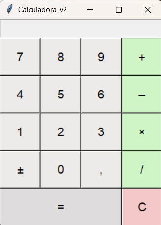

# Calculadora em Python com Tkinter - v2

Segunda versão do projeto de calculadora, agora com interface gráfica usando Tkinter. Evolui a lógica da v1 (terminal) para uma calculadora funcional com visor, teclado numérico, operações básicas, suporte a números decimais e negativos, e tratamento de erros comuns de uso.

## Interface


## Funcionalidades

- Operações básicas: soma, subtração, multiplicação e divisão
- Visor (Entry) bloqueado para digitação manual, controlado apenas pelos botões
- Suporte a números decimais (botão ",")
- Suporte a números negativos via botão de alternância de sinal (±)
- Repetição da última operação ao pressionar "=" múltiplas vezes
- Botão de limpar (C), que reseta valores e visor
- Tratamento de erros:
  - Divisão por zero
  - Cliques em operações ou "=" com o visor vazio
  - Estado inicial do visor bloqueado corretamente desde a abertura
- Layout em grade 4x5, com destaque visual para os botões "=" e "C"

## Estrutura

```
calculadora_v2/
├── calculadora_v2.py
└── README.md
```

## Como rodar

```bash
python calculadora_v2.py
```

Requer Python 3 com Tkinter (já incluso na instalação padrão do Python na maioria dos sistemas).

## Lógica principal

- `clicar_botao(numero)`: insere dígitos no visor
- `clicar_operacao(op)`: guarda o primeiro valor e a operação escolhida, limpa o visor
- `clicar_igual()`: calcula o resultado; se pressionado repetidamente, repete a última operação usando o último valor inserido
- `clicar_virgula()`: insere "." no visor, impedindo múltiplos pontos no mesmo número
- `alternar_sinal()`: inverte o sinal do valor atual no visor
- `limpar()`: reseta visor e variáveis globais (`valor_1`, `operacao`, `valor_2`, `resultado_calculado`)
- `atualizar_entry(valor, limpar_antes)`: função auxiliar central que destrava, atualiza e trava o visor novamente, evitando repetição de código nas demais funções

## Aprendizados

- Diferença entre ler e reatribuir variáveis globais dentro de funções (`global` só é obrigatório na reatribuição)
- Uso de `lambda` para passar argumentos em `command` de botões sem executar a função na hora da criação
- Gerenciamento de estado (`state="readonly"`) para impedir edição direta do usuário mantendo controle via código
- Uso de `sticky` no `.grid()` para resolver problemas de alinhamento e espaçamento entre widgets
- Identificação de ambiguidade de design (uso duplo do botão "-" como operação e sinal) e decisão consciente de simplificar o escopo em vez de resolver via lógica complexa
- Criação de função auxiliar (`atualizar_entry`) para eliminar repetição de código entre múltiplas funções de clique

## Limitações conhecidas

- Não há suporte a entrada via teclado físico (apenas cliques nos botões)
- O botão "-" funciona exclusivamente como operação de subtração; números negativos são inseridos apenas via botão dedicado (±)

## Próximos passos

- Implementar suporte a teclado físico (`janela.bind()`)
- Avaliar suporte ao "-" como atalho de sinal negativo em contextos específicos, sem ambiguidade com a operação de subtração
